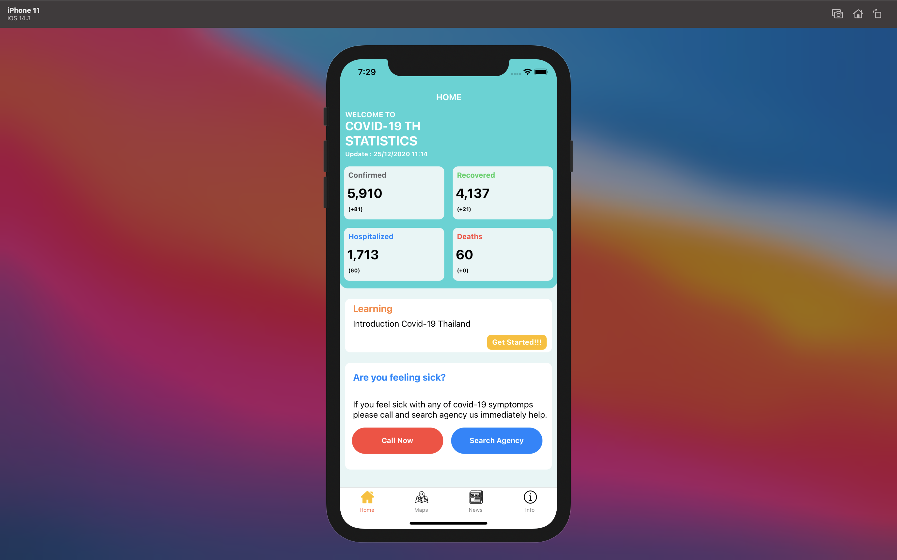
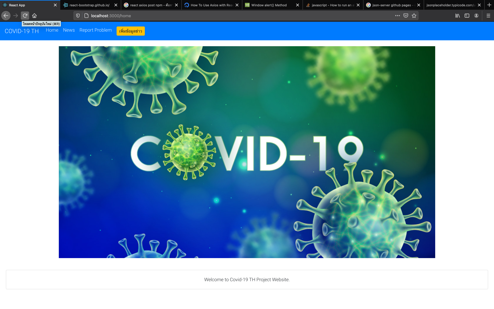
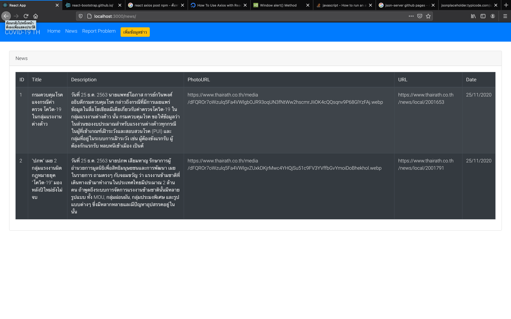
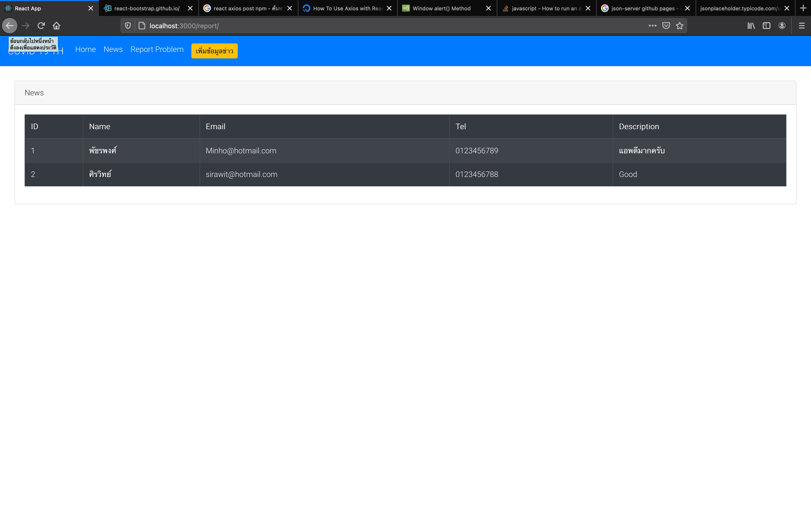
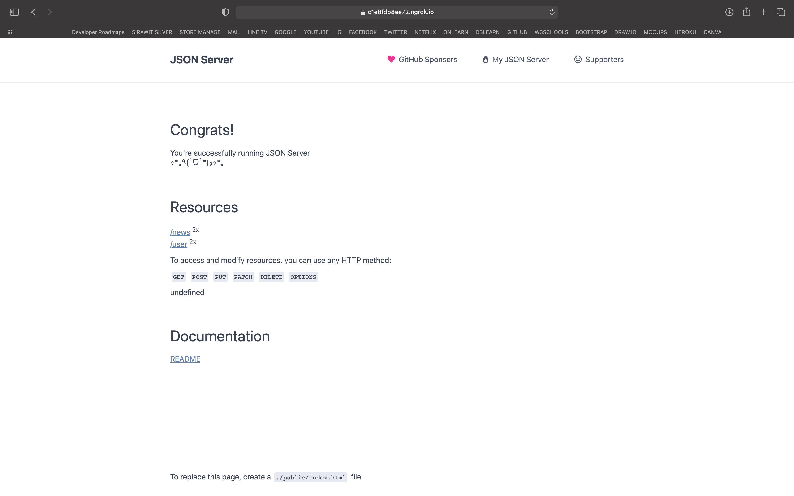
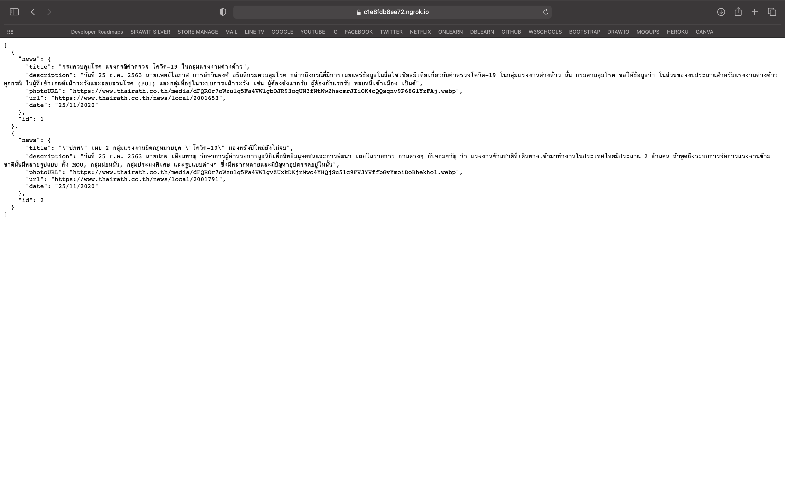
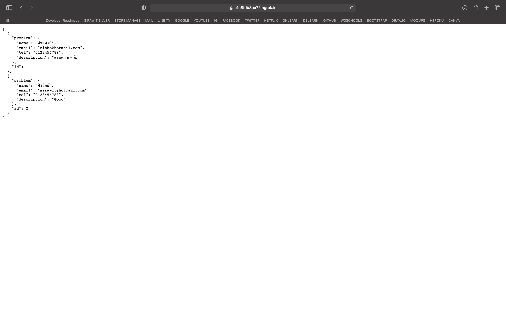

# COVID-19_TH_TNI

## React-Native (Recommend : IOS)

### Getting Started 
#### เมื่อดาวน์โหลดเสร็จ
1. Open project file
```
cd COVID-19_TH_TNI/
```
2. Run json-server | Mock Data
```
cd json-server/
```
```
npm install
```
```
npm run server
```
-  กด New Terminal (+)
```
cd json-server/
```
```
npm run ngrok
```
เสร็จในขั้นตอนการเปิด Public Server (Mock Data)
##### EDIT CODE (ส่วนของข่าว)
แก้ส่วนของ AXIOS (แก้ Mobile App)
```
File: COVID-19_TH/src/tab/News/NewScreen.js | Line : 23 
```
แก้ส่วนของ AXIOS (แก้ Website)
```
File: covid-webui/src/component/news.js | Line : 29
```
```
File: covid-webui/src/component/createnews.js | Line : 44
```

##### EDIT CODE (ส่วนของแจ้งปัญหาใช้งาน)
แก้ส่วนของ AXIOS (แก้ Mobile App)
```
File: COVID-19_TH/src/tab/Info/ReportScreen.js | Line : 26
```
แก้ส่วนของ AXIOS (แก้ Website)
```
File: covid-webui/src/component/report.js | Line : 30
```
  
3. Run Application ( COVID-19_TH | Mobile App : React Native )
-  New Terminal
```
cd COVID-19_TH/
```
```
npm install
```
```
npm run web
``` 

-  Next Step `Click Run on iOS simulator`
-->
4. Run Web (React | Admin)
- New Terminal
```
cd covid-webui/
```
```
npm install
```
```
npm start
```
5. อย่าลืม Forwarding http://c1e8fdb8ee72.ngrok.io -> http://localhost:9000 (ที่มาจากการ `npm run ngrok`) ให้นำลิงค์ที่ได้ [http://c1e8fdb8ee72.ngrok.io] นำมาใส่ในไฟล์ของ Mobile && Website ใส่ในส่วนของ Axios โดยมีลิงค์ดังนี้
- https://c1e8fdb8ee72.ngrok.io (JSON server)
- https://c1e8fdb8ee72.ngrok.io/user (ในส่วนของ การแจ้งปัญหา)
- https://c1e8fdb8ee72.ngrok.io/news (ในส่วนของ ข่าวสาร)
- หมายเหตุ https://c1e8fdb8ee72.ngrok.io ลิงค์นี้จะได้ไม่เหมือนกัน ซึ่งเมื่อเราทำการ `npm run ngrok` จะมีลิงค์เป็นของตัวเอง
  
### Reference
#### Mobile App (React Native)
<p align="center">
  
</p>
#### Website 
<p align="center">
  
</p>
<p align="center">
  
</p>
<p align="center">
  
</p>
#### JSON server 
<p align="center">
  
</p>
<p align="center">
  
</p>
<p align="center">
  
</p>


  
